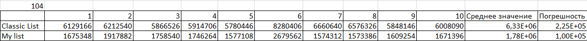
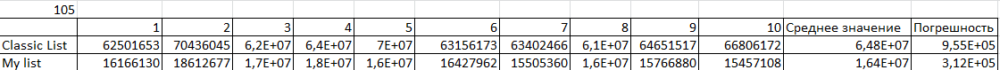
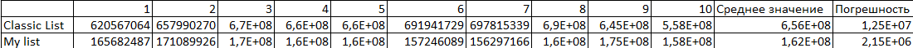
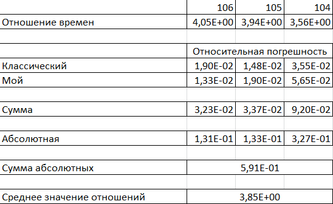

# Сравнение скорости работы классического списка и списка из структуры массивов
## Ход работы
Для обеспечения полной производительности процессора тесты проводим на зарядке, остановив все прочие программы, а так же отключим троттлинг процессора командой: "performance | sudo tee /sys/devices/system/cpu/cpu*/cpufreq/scaling_governor" и "-fno-sanitize=address -fno-sanitize=undefined" для отключения Sanitizers.

Снимем показания 3 раза для разных количеств итераций по 10 повторений для оценки погрешности. Погрешность будем оценивать как среднее квадратичное отклонение от среднего.

Таким образом получаем, что список на основе структуры из массивов рабоатет в среднем в (3.85 +- 0.6) раз быстрее, чем классический, из-за того, что все данные в структуре массивов расположены в памяти упорядоченно, в следствие чего процессор быстрее их находит, так как может предсказать расположение следующего элемента, что нельзя сказать о классическом списке.